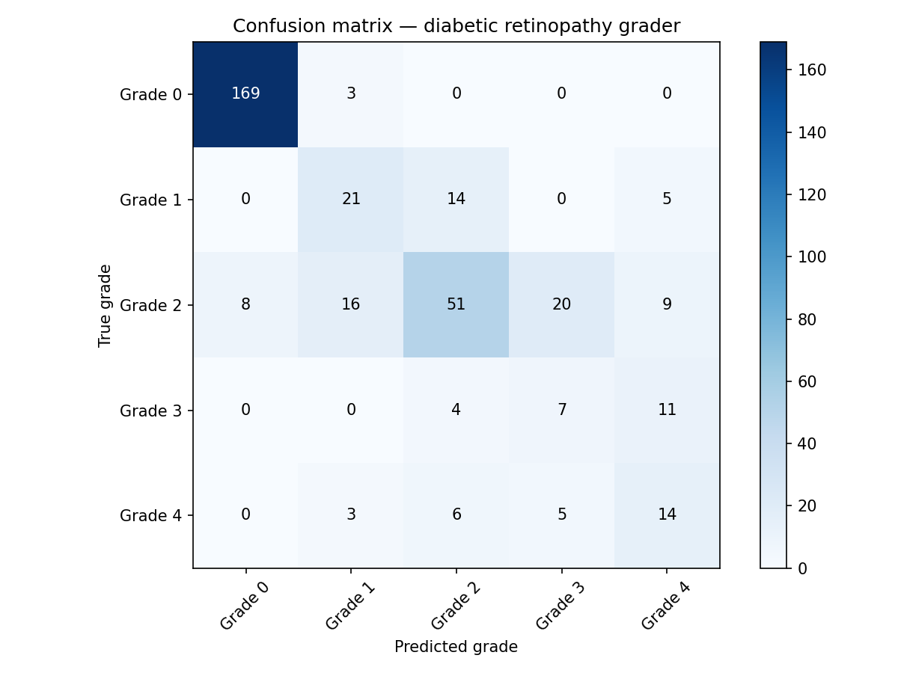
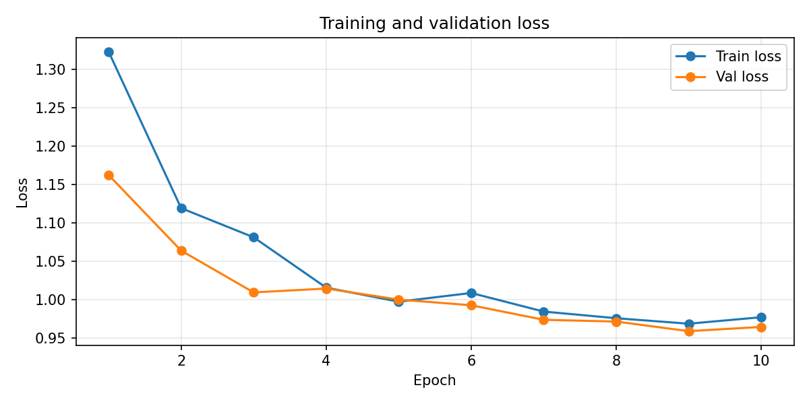

# Diabetic retinopathy severity classifier

A deep learning model that classifies diabetic retinopathy severity from retinal fundus images into 5 grades (0–4) using EfficientNet-B0 with transfer learning.

## Problem

Diabetic retinopathy (DR) is a leading cause of blindness worldwide. Early detection through retinal screening is critical but requires specialist graders — a scarce resource in many healthcare systems. This project automates severity grading from fundus photography.

## Dataset

[APTOS 2019 Blindness Detection](https://www.kaggle.com/datasets/mariaherrerot/aptos2019) — 3,296 retinal fundus images labelled by clinicians across 5 severity grades:

| Grade | Severity | Training samples |
|---|---|---|
| 0 | No DR | 1434 |
| 1 | Mild | 300 |
| 2 | Moderate | 808 |
| 3 | Severe | 154 |
| 4 | Proliferative | 234 |

## Architecture

- Base model: EfficientNet-B0 pretrained on ImageNet (frozen)
- Classifier head: Dropout(0.3) → Linear(1280, 5)
- Only the classifier head is trained — transfer learning from ImageNet features
- Loss: weighted CrossEntropyLoss to handle class imbalance
- Optimizer: Adam (lr=1e-3, StepLR scheduler halving every 3 epochs)
- Augmentation: random horizontal/vertical flip, rotation, colour jitter

## Results

| Metric | Value |
|---|---|
| Validation accuracy | 71.58% |
| Quadratic weighted kappa | 0.8206 |

Quadratic weighted kappa of 0.82 indicates strong agreement with clinical grades. The model makes clinically sensible errors — confusing adjacent grades rather than making large misclassifications.

### Confusion matrix

### Training curves

## Limitations and future work

- Class imbalance affects performance on rare grades (Grade 3 F1 = 0.26)

- Ben Graham preprocessing (local contrast normalisation) would likely improve performance significantly
- Fine-tuning unfrozen EfficientNet layers at lower learning rate as a second training stage
- Larger backbone (EfficientNet-B3/B4) with more training data
- Test time augmentation for more robust predictions at inference

## Requirements
torch

torchvision

timm

pandas

pillow

matplotlib

scikit-learn

tqdm

## Usage

Open `DiabeticRetinopathyProject.ipynb` in Google Colab and run cells sequentially. Dataset download requires a Kaggle API token.
